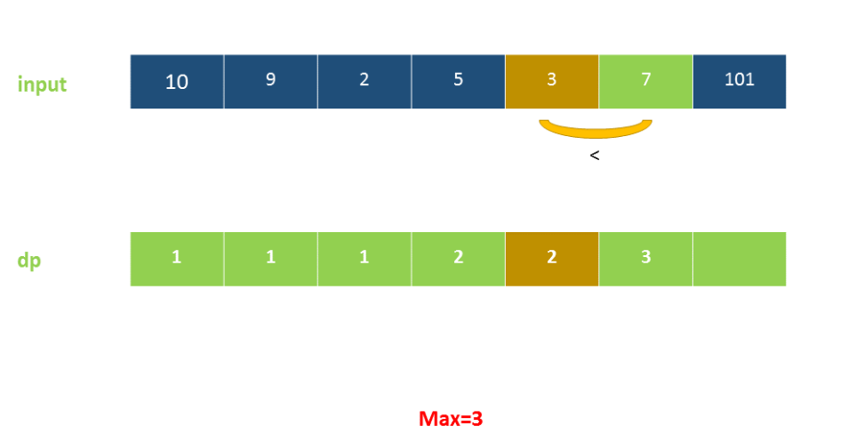

[代码随想录](https://www.bilibili.com/video/BV1QB4y1D7ep?vd_source=82d188e70a66018d5a366d01b4858dc1&spm_id_from=333.788.videopod.sections)

# 常用技巧

`join` 是胶水，不是容器。

join:

```python
新字符串 = "分隔符".join(要被连接的列表)
```

```python
a = ['1', '2', '3', '4']
print('.'.join(a))
#输出
#1.2.3.4
```


find:

```python
list.index(x[, start[, end]])
```

元素第一次出现的位置

deque:双向列表

```
q=deque()
q.popleft()
```


# 数组

## 704:二分法

通常使用左闭右开区间 [left,right)

```python
left=0
right=n
while left<right:
    middle=(left+right)//2
    if nums[middle]<target:
        right=middle
    if nums[middle]>target:
        left=middle-1
    
```

区间是左闭右开,因此仅`left<right`是非法的,使用这个作为循环条件

## 27:移除元素

快慢双指针法

## 977有序数组平方

中间开始,左右双指针

##  209 长度最小的子数组

快慢双指针

## 59.螺旋矩阵II   TODO

```python
class Solution:
    def generateMatrix(self, n: int,left=0) -> List[List[int]]:
        res=[[0] * n for _ in range(n)]
        startx, starty = 0, 0               # 起始点
        loop, mid = n // 2, n // 2          # 迭代次数、n为奇数时，矩阵的中心点
        count = 1                           # 计数

        for offset in range(1,loop+1):
            for i in range(startx,n-offset):
                res[starty][i]=count
                count+=1
            for i in range(starty,n-offset):
                res[i][n-offset]=count
                count+=1
            for i in range(n-offset,startx,-1):
                res[n-offset][i]=count
                count+=1
            for i in range(n-offset,starty,-1):
                res[i][starty]=count
                count+=1
            startx+=1
            starty+=1
    
        if n%2==1:
            res[n//2][n//2]=n**2
        return res
```

通过循环嵌套模拟,建议多看看类似的题目

# 链表


## [19. 删除链表的倒数第 N 个结点](https://leetcode.cn/problems/remove-nth-node-from-end-of-list/)

```python
# Definition for singly-linked list.
# class ListNode:
#     def __init__(self, val=0, next=None):
#         self.val = val
#         self.next = next
class Solution:
    def removeNthFromEnd(self, head: Optional[ListNode], n: int) -> Optional[ListNode]:
        dummy = ListNode(next=head)  
        slow = dummy                 
        right = head
        
        # 快指针先走n步
        for i in range(n):
            right = right.next
        
        while right:
            right = right.next
            slow = slow.next  # 移动慢指针
        
        # 删除目标节点：慢指针的下一个节点就是要删的倒数第n个节点
        slow.next = slow.next.next
        
        return dummy.next     # 修正3：返回虚拟头节点的next，永远不要return head！！！
```

原链表的 `head` 节点**有可能就是被删除的那个节点**,通过dummy节点避免这个问题

## [142. 环形链表 II](https://leetcode.cn/problems/linked-list-cycle-ii/)

```python
# Definition for singly-linked list.
# class ListNode:
#     def __init__(self, x):
#         self.val = x
#         self.next = None

class Solution:
    def detectCycle(self, head: Optional[ListNode]) -> Optional[ListNode]:
        slow = head
        fast = head
        
        while True:
            if not fast or not fast.next:
                return None
            slow = slow.next
            fast = fast.next.next
            if slow == fast:
                break
        
        slow = head
        
        while fast != slow:
            slow = slow.next
            fast = fast.next
        
        return fast
```

公式可以去题目里面看一下,有点抽象


# 哈希表

查询元素是否出现过

## [242.有效的字母异位词](https://leetcode.cn/problems/valid-anagram/)

`Counter(s)`用于生成一个字典,key:value 为key对应的出现次数

标准做法是下面这样使用哈希表,但是`Counter(s)`是封装好的高级函数,有空看一下

```python
class Solution:
    def isAnagram(self, s: str, t: str) -> bool:
        n=len(s)
        dis=defaultdict(int)
        dit=defaultdict(int)
        if len(t)!=n:
            return False
        for i in range(n):
            dis[s[i]]+=1
            dit[t[i]]+=1
        if dis==dit:
            return True
        return False
```


## [349. 两个数组的交集](https://www.bilibili.com/video/BV1ba411S7wu/?share_source=copy_web&vd_source=9e952e3695aa7bfc9ff110afee9f3d34)

1.用数组充当hash table

```python
class Solution:
    def intersection(self, nums1: List[int], nums2: List[int]) -> List[int]:
        arr=[0 for _ in range(1001)]
        res=[]
        for i in nums1:
            arr[i]+=1
        for j in nums2:
            if arr[j]:
                res.append(j)
                arr[j]=0
        return res
```

## 2.通过字典映射

```python
class Solution:
    def intersection(self, nums1,nums2):
        hash_dict = {}
        for i in nums1:
            if i in hash_dict:
                hash_dict[i] += 1
            else:
                hash_dict[i] = 1
        result_set = set()
        for j in nums2:
            if j in hash_dict.keys(): #hash_dict.keys():key变成list
                result_set.add(j)
                del hash_dict[j]
        return list(result_set)
```

## 3.set哈希表

```python
class Solution:
    def intersection(self, nums1: List[int], nums2: List[int]) -> List[int]:
        hashtable=set()
        res=set()
        for i in nums1:
            hashtable.add(i)
        
        for j in nums2:
            if j in hashtable:
                res.add(j)
                
        return list(res)
```

## [1. 两数之和](https://leetcode.cn/problems/two-sum/)

用字典作为哈希表,用数组同理

```python
class Solution:
    def twoSum(self, nums, target):
        hash_map = {}
        for i, num in enumerate(nums):
            temp=target-num
            if temp in hash_map:
                return [hash_map[temp],i]
            else:
                hash_map[num]=i
```

## [454. 四数相加 II ](https://leetcode.cn/problems/4sum-ii/)   TODO

1.暴力:超时

```python
class Solution:
    def fourSumCount(self, nums1: List[int], nums2: List[int], nums3: List[int], nums4: List[int]) -> int:
        count=0
        for i in nums1:
            for j in nums2:
                for k in nums3:
                    for l in nums4:
                        if i+j+k+l==0:
                            count+=1
        return count
```

**2.分治**

n1和n2组成一个hash table,n3和n4组成一个,然后再求组合为0 , 复杂度O$(n^2)$ (四数相加变为两数之和)

```python
class Solution:
    def fourSumCount(self, nums1: List[int], nums2: List[int], nums3: List[int], nums4: List[int]) -> int:
        res=0
        count1=defaultdict(int)
        count2=defaultdict(int)
        for i in nums1:
            for j in nums2:
                count1[i+j]+=1
        for k in nums3:
            for l in nums4:
                    count2[k+l]+=1

        for i in count1.keys():
            for j in count2.keys():
                if i+j==0:
                    res+=count1[i]*count2[j]
        return res
```

3. 优化:使用python提供的更优方法

```python
class Solution:
    def fourSumCount(self, nums1: List[int], nums2: List[int], nums3: List[int], nums4: List[int]) -> int:
        d1=defaultdict(int)
        count=0
        for i in nums1:
            for j in nums2:
                d1[i+j]+=1
        for i in nums3:
            for j in nums4:
                	
                    count+=d1[-(i+j)]
        return count
```

## [15. 三数之和 ](https://leetcode.cn/problems/3sum/)  TODO

固定一个值,然后移动另外两个作为双指针(我固定中间值这个做法有点蠢),排序O(nlogn) ,固定双指针$O(n^2)$

```python
class Solution:
    def threeSum(self, nums: List[int]) -> List[List[int]]:
        nums.sort()
        ans = []
        n = len(nums)
        for i in range(n-2):
            #跳过重复的i，避免重复解
            if i > 0 and nums[i] == nums[i-1]:
                continue
            j,k=i+1,n-1
            while j<k:
                s = nums[i] + nums[j] + nums[k]
                if s == 0:
                    ans.append([nums[i], nums[j], nums[k]])
                    # 【修正3】找到解后再去重 ✅ 正确时机，先去重再移指针，避免重复解
                    while j < k and nums[j] == nums[j+1]:
                        j += 1
                    while j < k and nums[k] == nums[k-1]:
                        k -= 1
                    # 【修正1】核心！找到解后必须移动指针，否则死循环
                    j += 1
                    k -= 1
                elif s > 0:
                    k -= 1
                elif s < 0:
                    j += 1
            i+=1
        return ans
```


```python
 使用字典

class Solution:
    def threeSum(self, nums: List[int]) -> List[List[int]]:
        result = []
        nums.sort()
        # 找出a + b + c = 0
        # a = nums[i], b = nums[j], c = -(a + b)
        for i in range(len(nums)):
            # 排序之后如果第一个元素已经大于零，那么不可能凑成三元组
            if nums[i] > 0:
                break
            if i > 0 and nums[i] == nums[i - 1]: #三元组元素a去重
                continue
            d = {}
            for j in range(i + 1, len(nums)):
                if j > i + 2 and nums[j] == nums[j-1] == nums[j-2]: # 三元组元素b去重
                    continue
                c = 0 - (nums[i] + nums[j])
                if c in d:
                    result.append([nums[i], nums[j], c])
                    d.pop(c) # 三元组元素c去重
                else:
                    d[nums[j]] = j
        return result
```

## [18. 四数之和](https://leetcode.cn/problems/4sum/) TODO

**n数之和就是在2数之和基础上套上循环**,降低一个n复杂度

```python
class Solution:
    def fourSum(self, nums: List[int], target: int) -> List[List[int]]:
        n=len(nums)
        nums.sort()
        if n<4:
            return[]
        res=[]
        
        for i in range(n-3):
            #防止重复
            if i > 0 and nums[i] == nums[i-1]:
                continue

            for j in range(i+1,n-2):
                #防止重复
                if j > i+1 and nums[j] == nums[j-1]:
                    continue
                    
                left1,right1=j+1,n-1
                while left1<right1:
                    s=nums[i]+nums[j]+nums[left1]+nums[right1]
                    if s==target:
                        res.append([nums[i],nums[j],nums[left1],nums[right1]])
                        ##防止重复
                        while left1<right1 and nums[left1]==nums[left1+1]:
                            left1+=1
                        left1+=1
                        ##防止重复
                        while  right1>left1 and  nums[right1]==nums[right1-1]:
                            right1-=1
                        right1-=1
                    elif s<target:
                        while  left1<right1 and nums[left1]==nums[left1+1]:
                            left1+=1
                        left1+=1
                    elif s>target:
                        while right1>left1 and nums[right1]==nums[right1-1]:
                            right1-=1
                        right1-=1
        return res
                
```


2.set做法,性能比上面略差,空间O(n)

```python
class Solution(object):
    def fourSum(self, nums, target):
        """
        :type nums: List[int]
        :type target: int
        :rtype: List[List[int]]
        """
        # 创建一个字典来存储输入列表中每个数字的频率
        freq = {}
        for num in nums:
            freq[num] = freq.get(num, 0) + 1
        
        # 创建一个集合来存储最终答案，并遍历4个数字的所有唯一组合
        ans = set()
        for i in range(len(nums)):
            for j in range(i + 1, len(nums)):
                for k in range(j + 1, len(nums)):
                    val = target - (nums[i] + nums[j] + nums[k])
                    if val in freq:
                        # 确保没有重复
                        count = (nums[i] == val) + (nums[j] == val) + (nums[k] == val)
                        if freq[val] > count:
                            ans.add(tuple(sorted([nums[i], nums[j], nums[k], val])))
        
        return [list(x) for x in ans]
```

# 字符串

## [344. 反转字符串](https://leetcode.cn/problems/reverse-string/)

```python
class Solution:
    def reverseString(self, s: List[str]) -> None:
        """
        Do not return anything, modify s in-place instead.
        """
        n=len(s)
        for i in range(n//2):
            s[i],s[n-i-1]=s[n-i-1],s[i]
        
```

## [541. 反转字符串 II](https://leetcode.cn/problems/reverse-string-ii/) TODO

### 自己的代码:

```python
class Solution:
    def reverseStr(self, s: str, k: int) -> str:
        n=len(s)
        times=n//(2*k)
        #2k部分
        for i in range(times):
            for j in range(k):
                # 你的代码里所有这种交换写法都会触发 TypeError
                #Python 中 str 类型的字符串是不可修改的，不能通过 s[index] = 新值 的方式修改某个位置的字符，也不能直接交换两个位置的字符。
                #应该先变成list再吃力
                s[i*2*k+j],s[i*2*k+k-j-1]=s[i*2*k+k-j-1],s[i*2*k+j]
        #剩余部分x
        i=times
        x=n%(2*k)
        if x >k:
            for j in range(k):
                s[i*2*k+j],s[i*2*k+k-j-1]=s[i*2*k+k-j-1],s[i*2*k+j]
        else :
            for j in range(x):
                
                s[i*2*k+j],s[n-j-1]=s[n-i-1],s[i*2*k+j]
                
                #正确的应该是
                s[i*2*k+j],s[n-j-1]=s[n-j-1],s[i*2*k+j]
```

修改后

```python
class Solution:
    def reverseStr(self, s: str, k: int) -> str:
        n = len(s)
        # 修正1：字符串转列表，解决不可变问题
        s_list = list(s)
        times = n // (2 * k)
        # 处理完整的2k段
        for i in range(times):
            start = i * 2 * k
            # 反转[start, start+k)区间，用切片替代手动交换，简洁高效
            s_list[start:start+k] = s_list[start:start+k][::-1]
        # 处理剩余部分
        x = n % (2 * k)
        start = times * 2 * k
        if x > k:
            # 剩余>=k个，反转前k个
            s_list[start:start+k] = s_list[start:start+k][::-1]
        else:
            # 剩余<k个，反转全部剩余，修正2：修正你的下标笔误问题
            s_list[start:n] = s_list[start:n][::-1]
        # 列表转回字符串
        return ''.join(s_list)
```


Python 的**切片语法**可以一行实现任意区间的反转，简洁 + 高效，比如 `arr[a:b] = arr[a:b][::-1]` 就能反转列表中 `[a,b)` 区间的元素。


## [151. 反转字符串中的单词](https://leetcode.cn/problems/reverse-words-in-a-string/) TODO

本题思路总结：1.先去除字符串多余的空格 2.再将去除空格后的字符串整个反转 3。最后在反转后的字符串中反转单词

```python
class Solution:
    def reverseWords(self, s: str) -> str:
        # s.split()用于将字符串按照指定的分隔符切割，返回一个字符串列表
        return " ".join(reversed(s.split()))
```


## [459. 重复的子字符串](https://leetcode.cn/problems/repeated-substring-pattern/)

```
class Solution:
    def repeatedSubstringPattern(self, s: str) -> bool:
        slist=list(s)
        n=len(s)
        if n<1:
            return True
        for i in range(1,n//2+1):
            if n%i==0:
                if s==s[:i]*(n//i):
                    return True
        return False
```

## [28. 找出字符串中第一个匹配项的下标](https://leetcode.cn/problems/find-the-index-of-the-first-occurrence-in-a-string/)

kmp算法实现,用内置函数套路一下

1.直接暴力匹配 O(m*n)

```python
class Solution:
    def strStr(self, haystack: str, needle: str) -> int:
        n = len(haystack)
        m=len(needle)
        for i in range(n):
            if needle==haystack[i:i+m]:
                return i
        return -1
```

2.找第一个子串:

✅ 1. `str.find(sub)` → 推荐（本题最优解）

- 找不到子串 → 返回 `-1`
- 无报错风险，**完全匹配本题需求**，是最常用的查找方法

✅ 2. `str.index(sub)` → 慎用（本题不能用）

- 找到子串 → 返回第一次出现的下标（和 find 一致）
- **找不到子串 → 直接抛出 ValueError 异常** ❌
- 本题如果用 `return haystack.index(needle)`，会在匹配失败时报错，无法通过测试用例！

✅ 3. `str.rfind(sub)` → 反向查找

- 功能：**从右往左**查找子串第一次出现的下标
- 例：`"ababa".rfind("aba")` → 返回 2 （最右侧的 aba 起始下标）

```python
class Solution:
    def strStr(self, haystack: str, needle: str) -> int:
        return  haystack.find(needle)
```

# 栈+队列

## [20. 有效的括号](https://leetcode.cn/problems/valid-parentheses/)

难度不大

```python
class Solution:
    def isValid(self, s: str) -> bool:
        arr=[]
        dic={'(':')','{':'}','[':']'}
        for i in s:

            if i in [')','}',']']:
                if not arr:
                    return False
                else:
                    j=arr.pop()
                    if dic[j]!=i:
                        return False
                    else:
                        continue
            else:
                    arr.append(i)
        if not arr:
            return True
        return False
```

优化一下写法

```python
class Solution:
    def isValid(self, s: str) -> bool:
        dic = {'(' : ')', '[' : ']', '{' : '}', '?' : '?'}
        stack = ['?']
        for c in s:
            if c in dic: stack.append(c)
            elif dic[stack.pop()] != c: return False
        return len(stack) == 1 
```


## [1047. 删除字符串中的所有相邻重复项](https://leetcode.cn/problems/remove-all-adjacent-duplicates-in-string/) TODO

使用栈和队列处理更轻松

```python
class Solution:
    def removeDuplicates(self, s: str) -> str:
        arr=[]
        sList=list(s)
        for i in s:
            if arr:
                if arr[-1]==i:
                    arr.pop()
                else:
                    arr.append(i)
            else:
                arr.append(i)
        return ''.join(arr)
```


## [150. 逆波兰表达式求值](https://leetcode.cn/problems/evaluate-reverse-polish-notation/)

```python
class Solution:
    def evalRPN(self, tokens: List[str]) -> int:
        arr=[]
        caculat=[ '+','-','*' , '/']
        for i in tokens:
            if i not in caculat:
                arr.append(int(i))
            else:
                c1=arr.pop()
                c2=arr.pop()
                if i=='+':
                    arr.append(c1+c2)
                elif i=='-':
                    arr.append(c2-c1)
                elif i=='*':
                    arr.append(c1*c2)
                elif i=='/':
                    arr.append(int(c2/c1))
        return arr[0]
```


## [239. 滑动窗口最大值](https://leetcode.cn/problems/sliding-window-maximum/) TODO

暴力,会超时(O(n*k)

```python
class Solution:
    def maxSlidingWindow(self, nums: List[int], k: int) -> List[int]:
        arr=[]
        n=len(nums)
        #可能有重复最大值,删去时要注意
        for i in range(n-k+1):
            arr.append(max(nums[i:i+k]))
        return arr
```

参考答案

```python
class Solution:
    def maxSlidingWindow(self, nums: List[int], k: int) -> List[int]:
        # 
        q=deque()
        ans=[]
        for i ,x in enumerate(nums):
            #淘汰过期元素
            while q and q[0]<=i-k:
                q.popleft()
            #淘汰无用元素
            # 保证队列里的下标对应的数值严格单调递减
            while q and nums[q[-1]]<x:
                q.pop()
            q.append(i)
            #当 i 增长到 k-1 时，
            # 说明第一个完整的窗口（长度为 k）已经形成了
            if i>=k-1:
                ans.append(nums[q[0]])
        return ans
```


#### 双端队列操作

```python
from collections import deque

# 创建一个空的deque
d = deque()

# 添加元素
d.append('a')
d.appendleft('b')
print(d) # 输出: deque(['b', 'a'])

# 移除元素
d.pop()
d.popleft()
print(d) # 输出: deque([])
```


## [347. 前 K 个高频元素](https://leetcode.cn/problems/top-k-frequent-elements/) TODO

o(NlogN) 整个排序

```python
import collections

class Solution:
    def topKFrequent(self, nums: List[int], k: int) -> List[int]:
        c = collections.Counter(nums)
        # 按照频率 (c[x]) 降序排序，取前 k 个
        sorted_keys = sorted(c.keys(), key=lambda x: c[x], reverse=True)
        return sorted_keys[:k]
```

O(NlogK) 堆排序

```python
import collections
import heapq

class Solution:
    def topKFrequent(self, nums: List[int], k: int) -> List[int]:
        c = collections.Counter(nums)
        # heapq.nlargest 自动维护堆，根据 c.get (即频率) 来排序
        # 通过 key 参数来指定一个函数，这个函数会在每个元素上被调用，
        # 其返回值将作为排序的依据
        return heapq.nlargest(k, c.keys(), key=c.get)
```

使用collections的内置函数

```python
import collections

class Solution:
    def topKFrequent(self, nums: List[int], k: int) -> List[int]:
        c = collections.Counter(nums)
        # most_common(k) 返回如 [(1, 3), (2, 2)] 的形式
        # 我们只需要取元组的第一个元素（即数字本身）
        return [item[0] for item in c.most_common(k)]
```

# 二叉树

## 递归

```python
class Solution:
    def preorderTraversal(self, root: TreeNode) -> List[int]:
        res = []
        
        def dfs(node):
            if node is None:
                return
            res.append(node.val)
            
            dfs(node.left)
            dfs(node.right)
        dfs(root)
        return res
```

前中后序接近,不赘述

## 迭代

借助**栈**实现


### [144. 二叉树的前序遍历](https://leetcode.cn/problems/binary-tree-preorder-traversal/)

```python
from collections import deque

class Solution:
    def preorderTraversal(self, root: TreeNode) -> List[int]:
        res = []
        t=[]
        if not root:
            return []
        t.append(root)

        while t:
            temp=t.pop()
            
            if temp.right:
                t.append(temp.right)
            if temp.left:
                t.append(temp.left)
            res.append(temp.val)
        
        return res
```


### [145. 二叉树的后序遍历](https://leetcode.cn/problems/binary-tree-postorder-traversal/)

```python

class Solution:
    def postorderTraversal(self, root: TreeNode) -> List[int]:
        res = []
        t=[]
        if not root:
            return []
        t.append(root)

        while t:
            temp=t.pop()
            if temp.left:
                t.append(temp.left)
            if temp.right:
                t.append(temp.right)
            res.append(temp.val)
        res.reverse()
        return res
```

先序后序比较简单,中序会复杂一点

[94. 二叉树的中序遍历](https://leetcode.cn/problems/binary-tree-inorder-traversal/)

```python
class Solution:
    def inorderTraversal(self, root: TreeNode) -> List[int]:
        res =[]
        stack=[]
        if not root:
            return []
        #中节点,用于避免在左之前弹出
        cur=root
        while cur or stack:
            if cur:
                stack.append(cur)
                cur=cur.left
            else:
                # 左边处理完,剩下中和右 , 中加入result
                cur=stack.pop()
                res.append(cur.val)
                cur=cur.right
        return res

```


## [102. 二叉树的层序遍历](https://leetcode.cn/problems/binary-tree-level-order-traversal/) TODO

层序遍历应使用队列

```python
class Solution:
    def levelOrder(self, root: Optional[TreeNode]) -> List[List[int]]:
        if not root:
            return []
        res = []
        # 语义化命名：queue=当前层队列，next_level=下一层节点，cur_level=当前层数值
        queue = [root]
        next_level = []
        cur_level = []

        while queue or next_level:
            cur_level = []
            next_level = []
            while queue:
                node = queue.pop(0)
                cur_level.append(node.val)
                if node.left:
                    next_level.append(node.left)
                if node.right:
                    next_level.append(node.right)
            res.append(cur_level)
            queue = next_level.copy()
        return res
```

官方解法,省去复制的时间和保存下一行的空间,更优秀

```python
class Solution:
    def levelOrder(self, root: Optional[TreeNode]) -> List[List[int]]:
        res = []
        if not root: return res
        queue = [root]
        while queue:
            level_size = len(queue) # 获取当前层节点数
            cur_level = []
            for _ in range(level_size): # 只遍历当前层的节点
                node = queue.pop(0)
                cur_level.append(node.val)
                if node.left: queue.append(node.left)
                if node.right: queue.append(node.right)
            res.append(cur_level)
        return res
```


## [226. 翻转二叉树](https://leetcode.cn/problems/invert-binary-tree/)

```
# Definition for a binary tree node.
# class TreeNode:
#     def __init__(self, val=0, left=None, right=None):
#         self.val = val
#         self.left = left
#         self.right = right
class Solution:
    def invertTree(self, root: Optional[TreeNode]) -> Optional[TreeNode]:
        def inv(node):
            #交换左右节点
            if not node:
                return
            temp=node.left
            node.left=node.right
            node.right=temp
        if not root:
            return
        inv(root)
        self.invertTree(root.left)
        self.invertTree(root.right)
        return root
```


## [101. 对称二叉树](https://leetcode.cn/problems/symmetric-tree/) TODO

后序遍历: 下层的信息向上层返回,比较内侧和外侧
` return compare(l.left,r.right) and compare(l.right,r.left)`

```python
class Solution:
    
            
    def isSymmetric(self, root: Optional[TreeNode]) -> bool:
        def compare(l,r):
            if l and (not r): return False
            elif (not l) and  r: return False
            elif (not l) and (not r): return True
            elif l.val != r.val : return False
            #把下面的答案递归上来
            return compare(l.left,r.right) and compare(l.right,r.left)
        if not root:
            return True
        return compare(root.left,root.right)
```


## [104. 二叉树的最大深度](https://leetcode.cn/problems/maximum-depth-of-binary-tree/)

```python
# Definition for a binary tree node.
# class TreeNode:
#     def __init__(self, val=0, left=None, right=None):
#         self.val = val
#         self.left = left
#         self.right = right
class Solution:
    def maxDepth(self, root: Optional[TreeNode]) -> int:
        def re_dep(l,r):
            if not l and not r :return 0
            if l and not r: return re_dep(l.left,l.right)+1
            if not l and  r: return re_dep(r.left,r.right)+1
            if l and r: return max( re_dep(l.left,l.right),re_dep(r.left,r.right),)+1
        if not root:
            return 0
        return re_dep(root.left,root.right)+1
```


## [222. 完全二叉树的节点个数](https://leetcode.cn/problems/count-complete-tree-nodes/)

跟上面差不多,从下往上传递信息

```python
class Solution:
    def countNodes(self, root: Optional[TreeNode]) -> int:
        if not root:
            return 0
        def func(l,r):
            if not l and not r : return 0
            elif r and not l :return 0
            elif l and not r: return 1
            return func(l.left,l.right)+func(r.left,r.right)+2
        return func(root.left,root.right)+1
```

### [257. 二叉树的所有路径](https://leetcode.cn/problems/binary-tree-paths/)


```python
# Definition for a binary tree node.
# class TreeNode:
#     def __init__(self, val=0, left=None, right=None):
#         self.val = val
#         self.left = left
#         self.right = right
class Solution:
    def binaryTreePaths(self, root: Optional[TreeNode]) -> List[str]:
        res=[]
        def xiaqian(pre,node):
            now=pre+"->"+str(node.val)
            if node.left: xiaqian(now,node.left)
            if node.right: xiaqian(now,node.right)
            if not node.left and not node.right: res.append(now)
        if not root:
            return []
        start=str(root.val)
        if  root.left:xiaqian(start,root.left)
        if  root.right:xiaqian(start,root.right)
        if not root.left and not root.right: res.append(start)
        return res
```


## [404. 左叶子之和](https://leetcode.cn/problems/sum-of-left-leaves/)

```python
class Solution:
    res=0
    def sumOfLeftLeaves(self, root: Optional[TreeNode]) -> int:
        self.res=0
        #flag=1为左,flag=0为右
        def sum_left_leaf(node,flag):
            if not node : return
            if node.left:sum_left_leaf(node.left,1)
            if node.right:sum_left_leaf(node.right,0)
            #左叶子
            if flag and ( not node.left) and (not node.right):
                self.res+=node.val
            
        if not root: return 0
        sum_left_leaf(root.left,1)
        sum_left_leaf(root.right,0)
        return self.res
```


## [513. 找树左下角的值](https://leetcode.cn/problems/find-bottom-left-tree-value/)

递归法

```python
class Solution:
    def findBottomLeftValue(self, root: Optional[TreeNode]) -> int:
        def func(node,level):
            #叶子
            if not node.left and not node.right:
                return node.val,level

            #只有单边
            if node.left and not node.right:
                return func(node.left,level+1)
            if node.right and not node.left:
                return func(node.right,level+1)
            #都有
            lv,llevel=func(node.left,level+1)
            rv,rlevel=func(node.right,level+1)
            if llevel<rlevel:
                return rv,rlevel
            return lv,llevel
        if not root: return 0
        v,l=func(root,1)
        return v
```


## [112. 路径总和](https://leetcode.cn/problems/path-sum/)

递归+全局变量

```python
class Solution:
    def hasPathSum(self, root: Optional[TreeNode], targetSum: int) -> bool:
        flag=False
        def dfs(node,target):
            nonlocal flag
            if flag or not node: return 
            if node.left: 
                dfs(node.left,target-node.val)
            if node.right: 
                dfs(node.right,target-node.val)
            #满足条件的叶子节点
            if not node.left and not  node.right and target==node.val:
                flag=True
        
        dfs(root,targetSum)
        return flag
```

优化一下

```python
class Solution:
    def hasPathSum(self, root: Optional[TreeNode], targetSum: int) -> bool:
        if not root: return False
        if not root.left and not root.right:
            return  targetSum==root.val
        return self.hasPathSum(root.left,targetSum-root.val) or self.hasPathSum(root.right,targetSum-root.val)
```


## [106. 从中序与后序遍历序列构造二叉树](https://leetcode.cn/problems/construct-binary-tree-from-inorder-and-postorder-traversal/)

自底向上递归建树

```python
class Solution:
    def buildTree(self, inorder: List[int], postorder: List[int]) -> Optional[TreeNode]:
        if not inorder : return None
        mid=postorder.pop()
        idx=inorder.index(mid)
        l=self.buildTree(inorder[:idx],postorder[:idx])
        r=self.buildTree(inorder[idx+1:],postorder[idx:])
        root=TreeNode(mid,l,r)
        return root
```


## [654. 最大二叉树](https://leetcode.cn/problems/maximum-binary-tree/)

和上一题一样,这里复杂度为O(N^2)

```python
class Solution:
    def constructMaximumBinaryTree(self, nums: List[int]) -> Optional[TreeNode]:
        if not nums: return
        idx=nums.index(max(nums))
        l=self.constructMaximumBinaryTree(nums[:idx])
        r=self.constructMaximumBinaryTree(nums[idx+1:])
        root=TreeNode(nums[idx],l,r)
        return root
```

优化:**单调栈**:单调递减

```python
# 654. 最大二叉树 - 单调栈解法
# 时间复杂度: O(n)，每个元素最多入栈出栈一次
# 空间复杂度: O(n)，单调栈最多存储 n 个节点

class Solution:
    def constructMaximumBinaryTree(self, nums: List[int]) -> Optional[TreeNode]:
        """
        核心思想：维护一个【单调递减栈】
        
        栈中存储的是 TreeNode 节点，从栈底到栈顶，节点值严格递减。
        
        对于每个新元素 num：
        1. 如果 num < 栈顶元素：num 应该成为栈顶元素的【右子节点】
           (因为 num 在栈顶元素的右边，且比它小)
        2. 如果 num > 栈顶元素：不断弹出栈顶，最后弹出的元素成为 num 的【左子节点】
           (被弹出的元素在 num 的左边，且比 num 小，所以是 num 的左子树)
        """
        stack = []  # 单调递减栈，存储 TreeNode 节点
        
        for num in nums:
            # 为当前数字创建新节点
            node = TreeNode(num)
            
            # 关键步骤1：处理所有比当前值小的栈顶元素
            # 它们都应该成为当前节点的左子树的一部分
            while stack and stack[-1].val < num:
                # 弹出栈顶节点，它将成为当前节点的左子节点
                # (最后一个被弹出的节点才是直接左子节点)
                node.left = stack.pop()
            
            # 关键步骤2：如果栈不为空，说明栈顶元素比当前值大
            # 当前节点应该成为栈顶元素的右子节点
            if stack:
                stack[-1].right = node
            
            # 将当前节点入栈
            stack.append(node)
        
        # 栈底元素就是整棵树的根节点 (最大值对应的节点)
        return stack[0] if stack else None
```

与递归解法对比：递归 O(n²) 最坏，单调栈 O(n)


## [617. 合并二叉树](https://leetcode.cn/problems/merge-two-binary-trees/)

```python
class Solution:
    def mergeTrees(self, root1: Optional[TreeNode], root2: Optional[TreeNode]) -> Optional[TreeNode]:
        root=TreeNode()

        if not root1:
            root= root2
        elif not root2:
            root= root1
        elif root1 and root2:
            root.val= root1.val+root2.val
            root.left= self.mergeTrees(root1.left,root2.left)
            root.right= self.mergeTrees(root1.right,root2.right)
        return root
```


## [98. 验证二叉搜索树](https://leetcode.cn/problems/validate-binary-search-tree/)

```python
class Solution:
    temp=float('-inf')
    def isValidBST(self, root: Optional[TreeNode]) -> bool:
        if not root:
            return True

        l=self.isValidBST(root.left)
        if  self.temp>=root.val:
            return False
        else : 
            self.temp=root.val
        if l:
            r=self.isValidBST(root.right)
        return l and r
```

优化一下,避免多余计算

```python
class Solution:
    temp=float('-inf')
    def isValidBST(self, root: Optional[TreeNode]) -> bool:
        if not root:
            return True

        l=self.isValidBST(root.left)
        if l:
            if  self.temp>=root.val:
                return False
            else : 
                self.temp=root.val
                r=self.isValidBST(root.right)
        return l and r
```


## [530. 二叉搜索树的最小绝对差](https://leetcode.cn/problems/minimum-absolute-difference-in-bst/)

中序遍历,和上面差不多

```python
class Solution:
    cha=1e5
    last=-1e5
    def getMinimumDifference(self, root: Optional[TreeNode]) -> int:
        
        def mid(node):
            if not node:
                return
            mid(node.left)
            self.cha=min(self.cha,node.val-self.last)
            self.last=node.val
            mid(node.right)
        mid(root)
        return int(self.cha) 
```


## [501. 二叉搜索树中的众数](https://leetcode.cn/problems/find-mode-in-binary-search-tree/)

```python
class Solution:
    def findMode(self, root: Optional[TreeNode]) -> List[int]:
        self.count=0
        self.max_count=0
        self.curr=int(-1e5-1)
        self.res=[]
        def mid(node):
            if not node:
                return
            mid(node.left)
            if node.val!=self.curr:
                self.curr = node.val 
                self.count=1
            else:
                self.count+=1
            if self.count>self.max_count:
                self.max_count=self.count
                self.res=[node.val]
            elif self.count==self.max_count:
                self.res.append(node.val)
            mid(node.right)
        mid(root)
        return self.res
```


## [236. 二叉树的最近公共祖先](https://leetcode.cn/problems/lowest-common-ancestor-of-a-binary-tree/)

```python
class Solution:
    def lowestCommonAncestor(self, root: 'TreeNode', p: 'TreeNode', q: 'TreeNode') -> 'TreeNode':
        self.res=None
        def func(node,p,q):
            flag=0
            if self.res or not node:
                return False
            if node.val==p.val or node.val==q.val:
                flag+=1
            if func(node.left,p,q): flag+=1
            if func(node.right,p,q): flag+=1
            if flag==1: return True
            elif flag==2: 
                self.res=node
                return False
            return False
        func(root,p,q)
        return self.res
```

优化,不借助外部变量

```python
class Solution:
    def lowestCommonAncestor(self, root: 'TreeNode', p: 'TreeNode', q: 'TreeNode') -> 'TreeNode':
        # 1. 终止条件 / Base Case
        # 如果越过叶子节点，或者找到了 p 或 q 其中一个，直接返回当前节点
        if not root or root == p or root == q:
            return root
        
        # 2. 递归 / Recursion
        # 去左边找
        left = self.lowestCommonAncestor(root.left, p, q)
        # 去右边找
        right = self.lowestCommonAncestor(root.right, p, q)
        
        # 3. 处理 / Conquest
        # 情况A: 左右两边都有返回值，说明 p 和 q 分别在两侧
        # 此时 root 就是最近公共祖先
        if left and right:
            return root
        
        # 情况B & C: 只有一边有返回值（或者两边都空）
        # 说明 p 和 q 都在这一边（或者都没找到）
        # 直接把找到的结果向上传递
        if left:
            return left
        return right
```


## [701. 二叉搜索树中的插入操作](https://leetcode.cn/problems/insert-into-a-binary-search-tree/)

```python
class Solution:
    def insertIntoBST(self, root: Optional[TreeNode], val: int) -> Optional[TreeNode]:
        temp=TreeNode(val)
        if not root:
            return temp
        node=root
        while node:
            if node.val>val :
                if not node.left:
                    node.left=temp
                    return root
                else:
                    node=node.left
            if node.val<val :
                if not node.right:
                    node.right=temp
                    return root
                else:
                    node=node.right
```

## [450. 删除二叉搜索树中的节点](https://leetcode.cn/problems/delete-node-in-a-bst/)  TODO

```python
class Solution:
    #利用递归返回下一层的值,从而避免寻找父节点
    def deleteNode(self, root: Optional[TreeNode], key: int) -> Optional[TreeNode]:
        if not root:
            return None
        # 辅助函数：寻找以 node 为根的树中的最小值（一直往左走）
        def get_min( node):
            while node and node.left:
                node = node.left
            return node
        #递归找到key
        if root.val>key:
            root.left= self.deleteNode(root.left,key)
        elif root.val<key:
            root.right=self.deleteNode(root.right,key)
        else:
            #叶子
            if not root.left and not root.right:
                return None

            #只有其中一个节点
            elif not root.left:
                return root.right
            elif  not root.right:
                return root.left

            #左右节点都有
            else:
                #左下节点替代当前节点,继续递归删除最后的节点
                node0=get_min(root.right)
                root.val=node0.val
                root.right=self.deleteNode(root.right,node0.val)
                return root
```


## [669. 修剪二叉搜索树](https://leetcode.cn/problems/trim-a-binary-search-tree/) TODO

根据当前节点的值，果断**放弃掉不需要的那一半子树**

```python
class Solution:
    def trimBST(self, root: Optional[TreeNode], low: int, high: int) -> Optional[TreeNode]:
        if not root:
            return
        #舍弃半边子树和自己
        if root.val<low:
            root.left=None
            root=self.trimBST(root.right,low,high)
        elif root.val>high:
            root.right=None
            root=self.trimBST(root.left,low,high)
        else:
            root.right=self.trimBST(root.right,low,high)
            root.left=self.trimBST(root.left,low,high)
        return root
```


## [108. 将有序数组转换为平衡二叉搜索树](https://leetcode.cn/problems/convert-sorted-array-to-binary-search-tree/) todo

以中间作为分界,不断递归中序分治

```python
class Solution:
    def sortedArrayToBST(self, nums: List[int]) -> Optional[TreeNode]:
        if not nums:
            return None
        mid = len(nums)//2
        root = TreeNode(nums[mid])

        root.left=self.sortedArrayToBST(nums[:mid])
        root.right=self.sortedArrayToBST(nums[mid+1:])

        return root
```


## [538. 把二叉搜索树转换为累加树](https://leetcode.cn/problems/convert-bst-to-greater-tree/)

```python
class Solution:
    a=0
    def convertBST(self, root: Optional[TreeNode]) -> Optional[TreeNode]:
        if not root: return
        self.convertBST(root.right)
        root.val+=self.a
        self.a=root.val
        self.convertBST(root.left)

        return root
```

优化一下,确保调用时会清空self.pre

```python
class Solution:
    def convertBST(self, root: Optional[TreeNode]) -> Optional[TreeNode]:
        self.pre = 0
        def dfs(node):

            if not node:
                return 
            dfs(node.right)
            node.val = self.pre + node.val
            self.pre = node.val
            dfs(node.left)
        
        dfs(root)
        return root
```

# 回溯算法

组合 : [1,2,3,4,]有多少种两两组合方式
切割 : 切割后的子串都是回文子串
子集 : [1,2,3,4,]有多少种组合方式
组合 : 无顺序的排列
棋盘 : n皇后,解数独 

一般会带着多个参数进行回溯,在构建过程中不断添加

收集结果 : **叶子节点** or **所有节点**

##### 三部曲 : 处理 , 递归 , 回溯

**三部曲 : 处理(本层处理),递归(深层),回溯(从递归返回)**

## [77. 组合](https://leetcode.cn/problems/combinations/)  TODO

利用回溯,达到类似嵌套for循环的做法

```python
class Solution:
    def combine(self, n: int, k: int) -> List[List[int]]:
        res=[]
        path=[]
        def fun(s,e,k):
            #start,end,k 递归深度
            if len(path)==k:
                #path[:] path进行深拷贝,避免后续修改
                res.append(path[:]) 
                return
            else:
                for i in range(s,e+1):
                    path.append(i)
                    fun(i+1,e,k)
                    path.pop()
        fun(1,n,k)
        return res
```

## 上述代码可以优化,剪枝一下有

```python
class Solution:
    def combine(self, n: int, k: int) -> List[List[int]]:
        res=[]
        path=[]
        def fun(s,e,k):
            #start,end,k 递归深度
            n=len(path)
            #剪枝
            if k-n>e-s+1:
                return
            if n==k:
                res.append(path[:]) 
                return
            else:
                for i in range(s,e+1):
                    path.append(i)
                    fun(i+1,e,k)
                    path.pop()
        fun(1,n,k)
        return res
```


```python
return list(combinations(range(1,n+1),k))
```


## [216. 组合总和 III](https://leetcode.cn/problems/combination-sum-iii/)

```python
class Solution:
    def combinationSum3(self, k: int, n: int) -> List[List[int]]:
        res=[]
        path=[]
        def func(start):
            if len(path)==k and sum(path)==n:
                res.append(path[:])
            else:
                for i in range(start,10):
                    path.append(i)
                    func(i+1)
                    path.pop()
        func(1)
        return res
```

剪枝优化(自己写的)

```python
class Solution:
    def combinationSum3(self, k: int, n: int) -> List[List[int]]:
        res=[]
        path=[]
        def func(start):
            s,lenth=sum(path),len(path)
            if s>n or 10-start<k-lenth :
                return
            
            if len(path)==k and sum(path)==n:
                res.append(path[:])
            else:
                for i in range(start,10):
                    path.append(i)
                    func(i+1)
                    path.pop()
        func(1)
        return res
```


## [17. 电话号码的字母组合](https://leetcode.cn/problems/letter-combinations-of-a-phone-number/)

这里用递归会产生内存问题,比较麻烦

```python
class Solution:
    def letterCombinations(self, digits: str) -> List[str]:
        KEY = {'2': ['a', 'b', 'c'],
               '3': ['d', 'e', 'f'],
               '4': ['g', 'h', 'i'],
               '5': ['j', 'k', 'l'],
               '6': ['m', 'n', 'o'],
               '7': ['p', 'q', 'r', 's'],
               '8': ['t', 'u', 'v'],
               '9': ['w', 'x', 'y', 'z']}
        path=[]
        res=[]
        n=len(digits)
        def func(start):
            if start==n:
                res.append(''.join(path[:]))
                return
            for i in KEY[digits[start]]:
                path.append(i)
                func(start+1)
                path.pop()
        func(0)
        return res
```

也就打表恶心了点

## [39. 组合总和](https://leetcode.cn/problems/combination-sum/) TODO


```python
class Solution:
    def combinationSum(self, candidates: List[int], target: int) -> List[List[int]]:
        res=[]
        cur=[]
        candidates.sort()
        def func(start,target0):
            if target0==0:
                res.append(cur[:])
                return
            elif target0<2:
                return
            else:
                #通过start,避免重复组合
                for idx,i in enumerate(candidates[start:]):
                    if target<i : break #剪枝
                    cur.append(i)
                    func(idx+start,target0-i)
                    cur.pop()
        func(0,target)
        return res
```


## [40. 组合总和 II](https://leetcode.cn/problems/combination-sum-ii/)

**注意：**解集不能包含重复的组合。 

自己写的:通过count迫使连续部分全取,从而避免了重复计算

```python
class Solution:
    def combinationSum2(self, candidates: List[int], target: int) -> List[List[int]]:
        res=[]
        path=[]
        candidates.sort()
        n=len(candidates)
        def func(start,target):
            if target==0:
                res.append(path[:])
            else:
                for i,num in enumerate(candidates[start:]):
                    if target<num:
                        break
                    count=1
                    while i+start+count<n and candidates[i+start]==candidates[i+start+count]:
                        path.append(num)
                        count+=1

                    path.append(num)
                    func(start+i+count,target-num*count)
                    
                    for i in range(count):
                        path.pop()

        func(0,target)
        return res
```

法2:暴力法去重:超时(用tuple和set进行去重)

法3:剪枝仅保留一个元素,**删去其他重复元素,效率更高**(递归变少 , 因为第一个肯定包含所有的
而且直接使用索引,更省内存

**树层去重**

```python
class Solution:
    def combinationSum2(self, candidates: List[int], target: int) -> List[List[int]]:
        res=[]
        path=[]
        candidates.sort()
        n=len(candidates)
        def func(start,target):
            if target==0:
                res.append(tuple(path[:]))
            for i in range(start, len(candidates)):
                if candidates[i] > target: break
                #避免出现重复
                if i > start and candidates[i] == candidates[i - 1]: continue
                path.append(candidates[i])
                func(i+1,target-candidates[i])
                path.pop()

        func(0,target)


        return  res
```


# 回溯切割

## [131. 分割回文串](https://leetcode.cn/problems/palindrome-partitioning/)  TODO

使**每个子串都是 回文串** 。返回 `s` 所有可能的分割方案 

```python
class Solution:
    def partition(self, s: str) -> List[List[str]]:
        res=[]
        n=len(s)
        path=[]
        def func(start_idx):
            if start_idx==n: 
                res.append(path.copy())
                return
            #切割后续子串
            for i in range(start_idx,n):
                #切割下来的子串,
                sub_string=s[start_idx:i+1]
                #数组操作,判断是否为回文子串
                if sub_string==sub_string[::-1]:
                    path.append(sub_string)
                    func(i+1)
                    path.pop()
        func(0)
        return res

```


错误答案:只考虑了奇数部分,没考虑偶数,而且**题目理解有问题**

```python
class Solution:
    def partition(self, s: str) -> List[List[str]]:
        res=[]
        n=len(s)
        def func(mid):
            path=s[mid]
            res.append(path)
            count=min(mid,n-1-mid)
            for i in range(1,count+1):
                c=s[mid+i]
                if s[mid-i]==c:
                    path=c.join(path).join(c)
                    res.append(path)
                else:
                    return
        for i in range(n):
            func(i)
        return res
```


## [93. 复原 IP 地址](https://leetcode.cn/problems/restore-ip-addresses/)  TODO


#### 自己写的错误答案

```python
class Solution:
    def restoreIpAddresses(self, s: str) -> List[str]:
        res=[]
        n=len(s)
        path=[]
        def func(start_idx):
            #
            if len(path)>4 or (len(path)==4 and start_idx!=n) or start_idx>n-1:
                return
            if start_idx==n and len(path)==4: 
                res.append(path.copy())
                return
            

            #切割子串
                #前导0
            if s[start_idx]=='0':
                path.append(s[start_idx])
                func(start_idx+1)
                path.pop()
                return

            #无前导0
            for i in range(start_idx,start_idx+3):
                #判断是否小于255(前导0已取出)
                

                #切割下来的子串,
                sub_string=s[start_idx:i+1]
                num=int(sub_string)

                if num>255:
                    return
                else:
                    path.append(sub_string)
                    func(i+1)
                    path.pop()
                #没有前导0
                
        func(0)
        res1=[]
        result_strings = ['.'.join(p) for p in res]
        return result_strings

```

#### 修改以后


```python
class Solution:
    def restoreIpAddresses(self, s: str) -> List[str]:
        res=[]
        n=len(s)
        path=[]
        def func(start_idx):
            if len(path) > 4:
                return
            
            # 如果遍历到了字符串末尾
            if start_idx == n:
                # 只有刚好切成4段才算成功
                if len(path) == 4:
                    res.append(path.copy())
                return

            #无前导0,min(start_idx + 3, n)用于避免越界
            for i in range(start_idx,min(start_idx + 3, n)):
                # 1. 检查前导 0：如果长度 > 1 且以 '0' 开头，非法

                sub_string=s[start_idx:i+1]
                num=int(sub_string)
                if len(sub_string) > 1 and sub_string.startswith('0'):
                    return
                if num>255:
                    return
                else:
                    path.append(sub_string)
                    func(i+1)
                    path.pop()
                #没有前导0
                
        func(0)
        res1=[]
        #.join(p)有返回值,上面的做法不正确(不修改原来的p)
        result_strings = ['.'.join(p) for p in res]
        return result_strings

```

优雅写法

```python
class Solution:
    def restoreIpAddresses(self, s: str) -> List[str]:
        # 预先判断：如果字符串长度不在合法范围内 [4, 12]，直接返回空
        if len(s) < 4 or len(s) > 12:
            return []
            
        res = []
        n = len(s)
        
        # path: 当前已经收集到的段列表
        # start: 当前处理到的字符串索引
        def backtrack(start, path):
            # --- 核心优化：强力剪枝 ---
            # 计算还需要凑几个段
            needs = 4 - len(path)
            # 计算还剩多少个字符
            remain = n - start
            
            # 如果剩余字符 不够分 (remain < needs) 
            # 或者 剩余字符 太多了 (remain > 3 * needs)，直接剪枝
            if remain < needs or remain > 3 * needs:
                return
            
            # 终止条件：如果不满足上面的剪枝，且 path 满了 4 个，
            # 说明肯定正好分完（由剪枝逻辑保证），直接加入结果
            if len(path) == 4:
                res.append(".".join(path))
                return

            # --- 循环逻辑 ---
            # 尝试截取长度 1, 2, 3
            for length in range(1, 4):
                # 越界检查
                if start + length > n:
                    break
                
                sub = s[start : start + length]
                
                # 1. 前导 0 检查：长度 > 1 且首位是 '0'，直接结束循环
                # (因为再往后切肯定也是 '0' 开头，都没戏)
                if length > 1 and sub[0] == '0':
                    break
                    
                # 2. 数值检查：大于 255，直接结束循环
                # (因为再往后切数值更大)
                if int(sub) > 255:
                    break
                
                # 递归
                # 技巧：直接传 path + [sub]，创建新列表传参
                # 这样利用了函数调用栈的特性，省去了 path.pop() 的显式回溯步骤
                backtrack(start + length, path + [sub])

        backtrack(0, [])
        return res
```


## [78. 子集](https://leetcode.cn/problems/subsets/)

子集问题，树上节点都是目标集和

```python
class Solution:
    def subsets(self, nums: List[int]) -> List[List[int]]:
        n=len(nums)
        res=[]
        path=[]
        def func(start):
            res.append(path.copy())
            for i in range(start,n):
                path.append(nums[i])
                func(i+1)
                path.pop()
        func(0)
        return res
```


## [90. 子集 II ](https://leetcode.cn/problems/subsets-ii/)  TODO

可能包含重复元素,解集 **不能** 包含重复的子集

```python
class Solution:
    def subsetsWithDup(self, nums: List[int]) -> List[List[int]]:
        nums.sort()
        n=len(nums)
        res=[]
        path=[]
        def func(start):
            for i in range(start,n):
                #去重,和之前的组合总和2完全一样
                if i > start and nums[i] == nums[i - 1]: continue
                path.append(nums[i])
                func(i+1)
                path.pop()
            res.append(path.copy())
        func(0)
        return res
```


## [491. 非递减子序列](https://leetcode.cn/problems/non-decreasing-subsequences/)

这道题是回溯算法中的“深坑”，因为它和我们之前做的《子集II》非常像，但有一个**核心矛盾**：

1. **求子序列**：不能改变原数组的顺序，所以**不能排序**。
2. **去重**：因为不能排序，所以我们之前熟练的 `if i > start and nums[i] == nums[i-1]` 这种去重逻辑**失效了**。
3. 要在**每一层递归**中，维护一个 `set`（哈希集合），记录**这一层**到底使用了哪些数字。如果这一层已经处理过数字 `7`，后面再遇到 `7` 就直接跳过，不管它们在原数组中是不是相邻的。

```python
class Solution:
    def findSubsequences(self, nums: List[int]) -> List[List[int]]:
        res = []
        path = []
        n=len(nums)
        def backtracking(startIndex):
            #超过两个节点,都符合条件
            if len(path) >=2:
                #这里不是分割,因此不用return
                res.append(path[:])
            usage_set = set()
            for i in range(startIndex,n):
                #不递增,跳过
                if path and path[-1]>nums[i]: continue
                #有重复字段 如4,7,7 因为有记录,会跳过第二个 [4,7]
                if nums[i] in usage_set : continue
                #
                usage_set.add(nums[i])
                path.append(nums[i])

                #递归
                backtracking(i+1)
                path.pop()
                # 注意：usage_set 不需要回溯（不需要 remove）！
                # 因为 usage_set 只是为了控制“当前这一层”不能重复选同一个数值
                # 下一层递归会创建它自己的新 set，互不影响。
        backtracking(0)
            
        return res
```


## [46. 全排列](https://leetcode.cn/problems/permutations/)


使用usage记录使用过的部分

```python
class Solution:
    def permute(self, nums: List[int]) -> List[List[int]]:
        res = []
        path = []
        usage=[0 for i in range(len(nums))]
        def backtracking():
            if len(path)==len(nums):
                res.append(path[:])
            for idx,num in enumerate(nums):
                if usage[idx] !=0: continue
                path.append(num)
                usage[idx]=1
                backtracking() 
                path.pop()
                usage[idx]=0
        backtracking()
        return res
```


**错误1**

每一次迭代都构建切片,内存消耗大,爆内存

```python
class Solution:
    def permute(self, nums: List[int]) -> List[List[int]]:
        res = []
        path = []

        def backtracking(n):
            if len(path)==len(nums):
                res.append(path)
            for idx,num in enumerate(n):
                path.append(num)
                backtracking(n[0:idx-1]+n[idx+1:len(n)]) 
                path.pop()
        backtracking(nums)
        return res
```


## [47. 全排列 II](https://leetcode.cn/problems/permutations-ii/) TODO

再优化

```python
class Solution:
    def permuteUnique(self, nums: List[int]) -> List[List[int]]:
        nums.sort()
        res = []
        path = []
        usage=[False for i in range(len(nums))]
        def backtracking():
            if len(path)==len(nums):
                res.append(path[:])
                return
            for i,num in enumerate(nums):
                #去掉已经加入的元素
                if usage[i] : continue
                # 当前层去重 , 不用set
                if i > 0 and nums[i] == nums[i-1] and not usage[i-1]:
                    continue
                
                #回溯计算
                path.append(num)
                usage[i]=True
                backtracking() 
                path.pop()
                usage[i]=False

        backtracking()
        return res
```


优化:在计算过程中剪枝

```python
class Solution:
    def permuteUnique(self, nums: List[int]) -> List[List[int]]:
        res = []
        path = []
        usage=[False for i in range(len(nums))]
        def backtracking():
            if len(path)==len(nums):
                res.append(path[:])
            levelUsage=set()
            for idx,num in enumerate(nums):
                #去掉已经加入的元素
                if usage[idx] !=0: continue
                # 当前层去重
                if num in  levelUsage :continue
                
                #回溯计算
                path.append(num)
                levelUsage.add(num)
                usage[idx]=True
                backtracking() 
                path.pop()
                usage[idx]=False
                
        backtracking()
        return res
```


给定一个可包含重复数字的序列 `nums` ，***按任意顺序*** 返回所有不重复的全排列。

修改上一道题,通过in来去重,时间复杂度 : O(N!)

```python
class Solution:
    def permuteUnique(self, nums: List[int]) -> List[List[int]]:
        res = []
        path = []
        usage=[0 for i in range(len(nums))]
        def backtracking():
            if len(path)==len(nums) and (path not in res):
                res.append(path[:])
            for idx,num in enumerate(nums):
                if usage[idx] !=0: continue
                path.append(num)
                usage[idx]=1
                backtracking() 
                path.pop()
                usage[idx]=0
        backtracking()
        return res
```


## [51. N 皇后](https://leetcode.cn/problems/n-queens/) TODO

用单个list记录元素,set记录对角线 , 节省空间和修改时间

```python
import numpy as np
from collections import defaultdict

class Solution:
    def solveNQueens(self, n: int) -> List[List[str]]:
        res=[]
        #记录各层元素位置
        queens=[-1]*n    

        #主对角线差相等
        main_diag={}
        #副对角线和相等
        sub_diag={}

        def backtrack(row:int):
            if row == n:
                path=[]

                for i in range(n):
                    a=['.']*n
                    a[queens[i]]='Q'
                    path.append(''.join(a))
                res.append(path[:])
                return
            
            for col in range(n):
                if row-col in sub_diag or row+col in main_diag or col in queens : continue

                queens[row]=col
                main_diag[row+col]=1
                sub_diag[row-col]=1

                backtrack(row+1)


                del main_diag[row+col]
                del sub_diag[row-col]

                queens[row]=-1
        backtrack(0)
        return res
```


拷贝问题,list.copy只能拷贝一层的结果,而且输出也有问题,需要修改

```py
import copy
class Solution:
    def solveNQueens(self, n: int) -> List[List[str]]:
        if n==1:
            return [["Q"]]
 
        if n <3:
            return []
        res=[]
        #path记录下过的点,side记录哪些部分还可以下
        path=[['.' for i in range(n)] for i in range(n)]
        side=[[True for i in range(n)] for i in range(n)]
        #遍历第row行,且树的深度也是row
        def back(row):
            if row==n:
                res.append(path.deepcopy())
                return
            #外层保存,便于复原
            nonlocal side
            rem=side.copy()
            for col in range(n):
                #禁区剪枝
                if not side[row][col]: continue

                #append
                path[row][col]='Q'
                
                #修改side
                for i in range(n):
                    side[i][col]=False
                #左下
                i,j=row+1,col-1
                while n>j>=0 and n>i>=0:
                    side[i][j]=False
                    i,j=i+1,j-1
                #右下
                i,j=row+1,col+1
                while n>j>=0 and n>i>=0:
                    side[i][j]=False
                    i,j=i+1,j+1
                
                #回溯
                back(row+1)

                #pop
                path[row][col]='.'
                side=rem
                
        back(0)
        return res
```


# 贪心算法

局部最优->全局最优 


## [455. 分发饼干](https://leetcode.cn/problems/assign-cookies/)

```python
class Solution:
    def findContentChildren(self, g: List[int], s: List[int]) -> int:
        count=0
        g.sort()
        s.sort()
        m,n=len(g),len(s)
        i=0
        #所有饼干已分完
        for j in range(n):
            #所有人都有饼干
            if i==m: break
            if s[j] >= g[i]:
                i+=1
                count+=1
        return count
```


## [376. 摆动序列](https://leetcode.cn/problems/wiggle-subsequence/) TODO

自己写的,边界条件不太好

```python
class Solution:
    def wiggleMaxLength(self, nums: List[int]) -> int:
        def fuhao(x):
            if x>0:
                return 1
            elif x<0:
                return -1
            return 0


        n=len(nums)
        if n==1:
            return 1
        #记录数字差的正负
        start=1
        while  nums[start]==nums[start-1]:
            start+=1
            if start==n:
                return 1
        flag=nums[start]>nums[start-1]
        count=2
        for i in range(start,n):
            if nums[i]==nums[i-1]: continue
            f=nums[i]>nums[i-1]
            if flag!=f:
                flag=f
                count+=1

        return count

```

优化一下

```python
class Solution:
    def wiggleMaxLength(self, nums: List[int]) -> int:
        n = len(nums)
        if n < 2:
            return n
        
        preDiff = 0  # 前一对差值
        curDiff = 0  # 当前一对差值
        count = 1    # 默认记录最后一个元素，所以从1开始
        
        for i in range(1, n):
            curDiff = nums[i] - nums[i - 1]
            
            # 出现摆动：
            # 1. 之前是平/增(pre>=0)，现在减(cur<0) -> 峰值
            # 2. 之前是平/减(pre<=0)，现在增(cur>0) -> 谷值
            if (curDiff > 0 and preDiff <= 0) or (curDiff < 0 and preDiff >= 0):
                count += 1
                preDiff = curDiff # 只有发生摆动时才更新 preDiff
                
        return count
```


## [53. 最大子数组和](https://leetcode.cn/problems/maximum-subarray/)

贪心算法:

```python
class Solution:
    def maxSubArray(self, nums: List[int]) -> int:
        maxsum=0
        last_sum=0
        n=len(nums)
        l_sub_list=0
        for i in range(n):
            last_sum+=nums[i]
            if last_sum <0:
                last_sum=0
            else:
                l_sub_list+=1
                maxsum=max(maxsum,last_sum)
        
        #全是负数,返回最大元素
        if l_sub_list==0:
            return max(nums)
        return maxsum
```

dp:用dp数组记录

```python
class Solution:
    def maxSubArray(self, nums: List[int]) -> int:
        dp = [0] * len(nums)
        dp[0] = nums[0]
        res = nums[0]
        for i in range(1,len(nums)):
            dp[i]=max(dp[i-1]+nums[i],nums[i])
        return max(dp)
```


## [122. 买卖股票的最佳时机 II](https://leetcode.cn/problems/best-time-to-buy-and-sell-stock-ii/)

低买高卖

```python
class Solution:
    def maxProfit(self, prices: List[int]) -> int:
        res=0

        n=len(prices)
        for i in range(1,n):
            cur=prices[i]-prices[i-1]
            if cur>0: res+=cur
        return res
```

## [55. 跳跃游戏](https://leetcode.cn/problems/jump-game/) TODO

1.DP动态规划:时间O(n^2) 空间O(n)

```python
class Solution:
    def canJump(self, nums: List[int]) -> bool:
        n=len(nums)
        dp=[False]*n
        dp[n-1]=True
        for i in range(n-2,-1,-1):
            for j in range(1,nums[i]+1):
                if j+i>=n:
                    break
                if dp[i+j]==True:
                    dp[i]=True
                    break
        return dp[0]
```

2. **贪心算法（Greedy）**。我们只需要正向遍历，动态维护一个“当前能够到达的最远位置”	

```python
class Solution:
    def canJump(self, nums: List[int]) -> bool:
        n=len(nums)
        if n==1:
            return True
        farest=nums[0]
        for i in range(n):
            if i>farest:
                break
            farest=max(farest,i+nums[i])
        return farest>=n-1
```


## [45. 跳跃游戏 II](https://leetcode.cn/problems/jump-game-ii/)  TODO

dp动态规划 , 时间O(n^2) , 空间O(n)

```python
class Solution:
    def jump(self, nums: List[int]) -> int:
        # 0 <= nums[i] <= 1000
        if len(nums)==1:
            return 0
        n=len(nums)
        dp=[99999]*n
        dp[0]=0
        for i in range(n):
            for j in range(1,nums[i]+1):
                if i+j>=n:
                    break
                dp[i+j]=min(dp[i]+1,dp[i+j])
            
        return dp[n-1]

```

**贪心算法（Greedy）** 维护覆盖范围 直至覆盖最后一个值

```python
class Solution:
    def jump(self, nums: List[int]) -> int:
        # 0 <= nums[i] <= 1000
        n=len(nums)
        last=0 #下一次覆盖范围
        count=0 
        end=0 #当前覆盖范围
        for i in range(n-1):
            last=max(last,i+nums[i])
            if i==end:
                end=last
                count+=1
        return count

```


## [1005. K 次取反后最大化的数组和 ](https://leetcode.cn/problems/maximize-sum-of-array-after-k-negations/) TODO

没写出来 , 自己这个做法没考虑全正的情况

```python
class Solution:
    def largestSumAfterKNegations(self, nums: List[int], k: int) -> int:
        count=0
        n=len(nums)
        negative=[]
        for i in range(n):
            if nums[i]<0:
                count+=1
                negative.append(nums[i])
        negative.sort() 
        ne=len(negative)
        if ne>=k:
            return sum(nums)-2*sum(negative[:k])
        if (k-ne)%2==0:
            return sum(nums)-2*sum(negative[:k])
        return sum(nums)-2*sum(negative[:ne-2])
```

官方解

```python
class Solution:
    def largestSumAfterKNegations(self, nums: List[int], k: int) -> int:
        #按绝对值降序排序
        nums.sort(key=lambda x: abs(x),reverse=True)
        #取反
        for i in range(len(nums)):
            if k>0 and nums[i]<0:
                nums[i]=-nums[i]
                k-=1
        # 处理剩余的k
        if k%2==1:
            nums[-1]*=-1
        return sum(nums)
```

## [134. 加油站](https://leetcode.cn/problems/gas-station/) 

注意:只有唯一起始位置

暴力法: 超时 时间O(n^2)

```python
class Solution:
    def canCompleteCircuit(self, gas: List[int], cost: List[int]) -> int:
        n=len(gas)
        for start in range(n):
            g=0
            flag=True
            for i in range(start,n):
                g=g+gas[i]-cost[i]
                if g <0:
                    flag=False
                    break
            for i in range(0,start):
                g=g+gas[i]-cost[i]
                if flag and g <0:
                    flag=False
                    break
             #压缩一下可以变成一个for
		   # for i in range(start,n+start):
                # g=g+gas[i%n]-cost[i%n]
                # if g <0:
                    # flag=False
                    # break       
             
            if  flag:
                return start

        
        return -1
```

### 贪心算法

- 情况一：如果gas的总和小于cost总和，那么无论从哪里出发，一定是跑不了一圈的
- 情况二：rest[i] = gas[i]-cost[i]为一天剩下的油，i从0开始计算累加到最后一站，**如果累加没有出现负数，说明从0出发，油就没有断过，那么0就是起点**。
- 情况三：如果累加的值是负数 , 则继续后续部分的和必然是正数 , 

```python
class Solution:

    def canCompleteCircuit(self, gas: List[int], cost: List[int]) -> int:
        n=len(gas)
        nums=[]
        for i in range(n):
            nums.append(gas[i]-cost[i])
        #  总燃油不够环湖
        if sum(nums)<0:
            return -1
        # 如果存在,只能有一个起点
        cur_sum=0
        mark=0
        for i in range(n):
            cur_sum+=nums[i]
            if cur_sum<0:
                #前面的多个<0的段合成一个<0的段
                cur_sum=0
                mark=i+1
        return mark
```


## [135. 分发糖果](https://leetcode.cn/problems/candy/) TODO

**两个维度都需要考虑的情况,不要同时去照顾两个条件,而应该先满足一个,再满足另外一个**

我的代码中使用了 `res = sum(dp) + (1-min(dp))*n` 的逻辑。你的意图是：先不管底线，按差值上下浮动，最后找出最小值，把所有人统一“垫高”使得最少的人刚好拿 1 颗糖。

- **问题所在：** 这种“一刀切”的整体平移会导致大量多余的糖果。比如评分是 `[10, 9, 8, 1, 2]`，为了填补 `8` 到 `1` 这个巨大的“谷底”，你会把毫无关系的 `10` 和 `9` 的糖果数也强行拉高，这无法得出**最少**糖果数目。正确的做法是：**遇到谷底时，谷底的孩子直接拿 1 颗糖重新开始计算**，不影响其他区间。

### 2. 两次遍历的组合方式错误 (最致命的逻辑漏洞)

你把从左到右的计算结果存为 `res`，然后又重新初始化数组进行从右到左的计算，最后返回 `min(正向总和, 反向总和)`。

- **问题所在：** 题目要求“相邻两个孩子中，评分更高的拿更多糖果”，这意味着**每一个孩子都必须同时满足左边和右边的约束**。
- 如果孩子 $A$ 因为比左边评分高，需要 $3$ 颗糖；又因为比右边评分高，需要 $5$ 颗糖。为了同时满足两侧的条件，他**必须**拿 $\max(3, 5) = 5$ 颗糖。因此，两次遍历的结果不能当做两个独立的方案去求最小值，而是要**针对每个位置取两次遍历的约束最大值**。

```python
class Solution:
    def candy(self, r: List[int]) -> int:
        n=len(r)
        dp=n*[1]
        if n==1:
            return 1
        for i in range(n-1):
            if r[i]<r[i+1]:
                dp[i+1]=dp[i]+1
            elif r[i]>r[i+1]:
                dp[i+1]=dp[i]-1
            else:
                dp[i+1]=0
        res=sum(dp)+(1-min(dp))*n
        dp=n*[1]
        for i in range(n-1,1,-1):
            if r[i]<r[i-1]:
                dp[i-1]=dp[i]+1
            elif r[i]>r[i-1]:
                dp[i-1]=dp[i]-1
            else:
                dp[i-1]=0
        

        return min(res,sum(dp)+(1-min(dp))*n)

```

答案

```python
from typing import List

class Solution:
    def candy(self, ratings: List[int]) -> int:
        n = len(ratings)
        # 初始化：每个孩子至少分配到 1 个糖果
        dp = [1] * n
        
        # 1. 从左往右遍历：确保右边评分高的孩子，糖果比左边多
        for i in range(1, n):
            if ratings[i] > ratings[i-1]:
                dp[i] = dp[i-1] + 1
                
        # 2. 从右往左遍历：确保左边评分高的孩子，糖果比右边多
        for i in range(n-2, -1, -1):
            if ratings[i] > ratings[i+1]:
                # 核心逻辑：必须要同时满足两边的条件，所以取 max
                dp[i] = max(dp[i], dp[i+1] + 1)
                
        return sum(dp)
```


[860. 柠檬水找零](https://leetcode.cn/problems/lemonade-change/)

easy 题,跳了


## [406. 根据身高重建队列](https://leetcode.cn/problems/queue-reconstruction-by-height/) TODO ,完全没思路

这类问题属于**区间调度**问题

高个子“看不见”矮个子，所以先安排高个子，后安排的矮个子无论怎么插队，都不会影响前面高个子的相对状态 , 实际目标是一个多条件排序

```python
class Solution:
    def reconstructQueue(self, people: List[List[int]]) -> List[List[int]]:
        #先按0排降序,再按1排升序
        people.sort(key=lambda x: (-x[0],x[1]))
        res=[]
        for p in people:
            res.insert(p[1],p)
        return res
```


## [452. 用最少数量的箭引爆气球](https://leetcode.cn/problems/minimum-number-of-arrows-to-burst-balloons/) 


自己的:按上一题的想法,改造即可

```python
class Solution:
    def findMinArrowShots(self, points: List[List[int]]) -> int:
        points.sort(key=lambda x:(x[1],x[0]))
        n=len(points)
        res=1
        #取最上值
        cur=points[0][1]
        for i in range(1,n):
            if points[i][0]<=cur and points[i][1]>=cur:
                continue
            else:
                res+=1
                cur=points[i][1]

        return res
```

优化:

**1. 排序条件存在冗余**

- **你的代码：** `points.sort(key=lambda x:(x[1],x[0]))`
- **优化思路：** 在这道贪心题目中，只要确定了右端点 `x[1]` 是递增的，当遇到右端点相同但左端点 `x[0]` 不同的气球时，它们谁先谁后并不影响我们“把箭射在当前最小右端点”的决策。因此，完全不需要引入第二个维度的排序。只按右端点排序不仅代码更精简，底层的比较操作也会更快。

**2. if 判断条件存在冗余**

- **你的代码：** `if points[i][0] <= cur and points[i][1] >= cur:`
- **优化思路：** 因为数组已经是按照右端点 `x[1]` 升序排列的，所以对于任何后续遍历到的气球 `i`，它的右端点 `points[i][1]` **必定大于或等于** 当前记录的最早结束位置 `cur`。这意味着 `points[i][1] >= cur` 这个条件是**绝对恒成立**的，属于无效的重复计算。我们只需要判断新气球的左端点是否超出了这支箭的覆盖范围（即 `points[i][0] > cur`）即可。


```python
class Solution:
    def findMinArrowShots(self, points: List[List[int]]) -> int:
        if not points:
            return 0
            
        # 优化1：仅仅按照气球的右边界进行升序排序
        points.sort(key=lambda x: x[1])
        
        res = 1
        cur = points[0][1] # 第一支箭射在第一个气球的右边界
        
        for i in range(1, len(points)):
            # 优化2：只需判断气球左边界是否超出了当前箭的位置
            # 如果超出，说明重叠区间断开，必须追加一支新箭
            if points[i][0] > cur:
                res += 1
                cur = points[i][1] # 新箭射在当前气球的右边界
                
        return res
```

按随想录推荐的重叠区间法做

```python
class Solution:
    def findMinArrowShots(self, points: List[List[int]]) -> int:
        points.sort(key=lambda x:x[0])
        n=len(points)
        res=1
        #取最上值
        cur=points[0][1]
        for i in range(n):
            if points[i][0]<=cur :
                cur=min(points[i][1],cur)
            else:
                res+=1
                cur=points[i][1]
        return res
```


## [435. 无重叠区间](https://leetcode.cn/problems/non-overlapping-intervals/)

找重叠区间,如果重叠了就删一个,删掉右边界最远的即可

```python
class Solution:
    def eraseOverlapIntervals(self, intervals: List[List[int]]) -> int:
        intervals.sort(key=lambda x:(x[0]))
        cur_start,cur_end=intervals[0]
        res=0
        n=len(intervals)
        for i in range(1,n):
            #重叠
            if intervals[i][0]<cur_end:
                cur_end=min(intervals[i][1],cur_end)
                res+=1
            else:
                #不重叠
                cur_end=intervals[i][1]
            
        return res
```


## [763. 划分字母区间](https://leetcode.cn/problems/partition-labels/)

```python
class Solution:
    def partitionLabels(self, s: str) -> List[int]:
        # 要求将s划分成尽量多的片段，保证每个片段中出现的字母不会出现在其他片段
        d=dict()
        n=len(s)
        #遍历记录各个字符最远距离
        for i in range(n):
            d[s[i]]=i
        start,end=0,0
        res=[]
        for i in range(n):
            if d[s[i]]>end:
                end=d[s[i]]
            if i==end:
                res.append(end-start+1)
                start=end+1
                if i+1<n:
                    end=d[s[i+1]]
            
        return res
```


## [56. 合并区间](https://leetcode.cn/problems/merge-intervals/)

```python
class Solution:
    def merge(self, intervals: List[List[int]]) -> List[List[int]]:
        intervals.sort()
        start,end=intervals[0]
        n=len(intervals)
        res=[]
        for i in range(n):
            #合并重叠
            if intervals[i][0]<=end:
                end=max(end,intervals[i][1])
            else:
                res.append([start,end])
                start,end=intervals[i]
        res.append([start,end])
        return res
                
```


## [738. 单调递增的数字](https://leetcode.cn/problems/monotone-increasing-digits/)   TODO

从前向后遍历的话，遇到strNum[i - 1] > strNum[i]的情况，让strNum[i - 1]减一，但此时如果strNum[i - 1]减一了，可能又小于strNum[i - 2]。 导致可能满足不了条件
比如 332，从前向后遍历的话，那么就把变成了329，此时2又小于了第一位的3了，真正的结果应该是299 显然不对

```python
class Solution:
    def monotoneIncreasingDigits(self, n: int) -> int:
        strNum = list(str(n))
        a=[]
        res=0
        n=len(strNum)
        for i in range(n-1,0,-1):
            # 如果当前字符比前一个字符小，说明需要修改前一个字符
            if strNum[i-1]>strNum[i]:
                strNum[i-1]=str(int(strNum[i-1])-1)
                 # 将前一个字符减1
                # 将修改位置后面的字符都设置为9，因为修改前一个字符可能破坏了递增性质
                for j in range(i, len(strNum)):
                    strNum[j] = '9'

        return int(''.join(strNum))
```

## [968. 监控二叉树](https://leetcode.cn/problems/binary-tree-cameras/)  TODO

叶子的父放置 , 如何每隔两层节点放置一个 ->从下往上遍历->贪心算法

错误:

1.状态转移逻辑错误（最核心的问题）

按照你的代码，假设状态是：`0`（无覆盖）、`1`（有相机）、`2`（被覆盖）。 当你遇到一个节点，它的左孩子是 `1`（有相机），右孩子是 `0`（无覆盖叶子）时：节点状态用 `(max(l, r) + 1) % 3` 推了出来，这个**状态转移是不对**的

2.根节点遗漏判断

如果一棵很大的树，经过层层向上传递，**最后根节点的状态推导出来是 `0`（即根节点没有被左右孩子覆盖到，自己也没有装相机）**。此时，虽然 `res` 可能已经是比如 5 或者 10，但你必须为这个孤立的根节点额外再加 1 个相机。你的代码忽略了这个边界情况。

```python
class Solution:
    def minCameraCover(self, root: Optional[TreeNode]) -> int:
        #后序遍历
        res=0
        def last_order(node):
            nonlocal res
            if not node:
                return 2
            
            l=last_order(node.left)
            r=last_order(node.right)
            #叶子为0
            if  l==0 or r==0:
                return 
            else:
                m= (max(l,r)+1)%3
                #值为1
                if m==1:
                    res+=1
                return m
        last_order(root)
        
        return res if res else 1
```


每个节点向父节点返回的**只有 1 个唯一确定的状态**（0代表未覆盖，1代表有相机，2代表已覆盖）

```python
class Solution:
    def minCameraCover(self, root: Optional[TreeNode]) -> int:
        res = 0

        def dfs(node):
            nonlocal res
            if not node:
                return 2   # 空节点视作已覆盖

            l = dfs(node.left)
            r = dfs(node.right)
			
            #左右孩子有未覆盖节点
            if l == 0 or r == 0:
                res += 1
                return 1   # 当前节点放摄像头

            if l == 1 or r == 1:
                return 2   # 当前节点被覆盖

            return 0       # 当前节点未覆盖
		
        仅有一个节点
        if dfs(root) == 0:
            res += 1

        return res
```


# 动态规划 DP


1. 确定dp数组（dp table）以及下标的含义
2. 确定递推公式
3. dp数组如何初始化
4. 确定遍历顺序
5. 举例推导dp数组

**递推公式决定了dp数组要如何初始化** , **找问题的最好方式就是把dp数组打印出来，看看究竟是不是按照自己思路推导的！**

## [509. 斐波那契数](https://leetcode.cn/problems/fibonacci-number/) 

简单题,秒了


## [746. 使用最小花费爬楼梯](https://leetcode.cn/problems/min-cost-climbing-stairs/)

dp转移

```python
class Solution:
    def minCostClimbingStairs(self, cost: List[int]) -> int:
        n=len(cost)
        dp=[0]*n
        for i in range(2,n):
            dp[i]=min(dp[i-2]+cost[i-2],dp[i-1]+cost[i-1])
        return min(dp[n-2]+cost[n-2],dp[n-1]+cost[n-1])
```

优化空间:

```python
class Solution:
    def minCostClimbingStairs(self, cost: List[int]) -> int:
        dp0 = 0  # 初始值，表示从起点开始不需要花费体力
        dp1 = 0  # 初始值，表示经过第一步不需要花费体力
        
        for i in range(2, len(cost) + 1):
            # 在第i步，可以选择从前一步（i-1）花费体力到达当前步，或者从前两步（i-2）花费体力到达当前步
            # 选择其中花费体力较小的路径，加上当前步的花费，得到当前步的最小花费
            dpi = min(dp1 + cost[i - 1], dp0 + cost[i - 2])
            
            dp0 = dp1  # 更新dp0为前一步的值，即上一次循环中的dp1
            dp1 = dpi  # 更新dp1为当前步的最小花费
        
        return dp1  # 返回到达楼顶的最小花费
```

## [62. 不同路径](https://leetcode.cn/problems/unique-paths/)

标准dp :构建边缘,再循环达到m,n处

```python
class Solution:
    def uniquePaths(self, m: int, n: int) -> int:
        dp=[[1]*n for i in range(m)]
        for i in range(1,m):
            for j in range(1,n):
                dp[i][j]=dp[i][j-1]+dp[i-1][j]
        return dp[m-1][n-1]
```


## [63. 不同路径 II](https://leetcode.cn/problems/unique-paths-ii/)

```python
class Solution:
    def uniquePathsWithObstacles(self, obstacleGrid: List[List[int]]) -> int:
        m,n=len(obstacleGrid[0]),len(obstacleGrid)
        dp=[[0]*m for i in range(n)]
        #初始化边界,遇到障碍物则后续变0
        for i in range(m):
            if obstacleGrid[0][i]==1:
                break
            dp[0][i]=1
        for i in range(n):
            if obstacleGrid[i][0]==1:
                break
            dp[i][0]=1
        for i in range(1,n):
            for j in range(1,m):
                if obstacleGrid[i][j]==0:
                    dp[i][j]=dp[i][j-1]+dp[i-1][j]
        return dp[n-1][m-1]
```


## [343. 整数拆分](https://leetcode.cn/problems/integer-break/) TODO

- `2 <= n <= 58` 因此可以用dp[i]表示这个数 i 拆分的最大值 , dp[i+1]由之前的数值构建即可 ,dp[i-j]就是对i-j再次进行拆分

错误答案:

```python
class Solution:
    def integerBreak(self, n: int) -> int:
        dp=[1]*(n+1)
        for i in range(3,(n+1)):
            #初始化res没有意义
            res=dp[i-1]
            for j in range(i):
                #状态转移有问题,可以不拆j的 , 即
                res=max(res,dp[j]*(i-j),dp[j]*dp[i-j])
            dp[i]=res
        return dp[-1]
```

 `dp[j]` 表示“j 被拆后的最大乘积”，不等于 `j`
所以不能用 `dp[j] * dp[i-j]` 代替真正的拆分情况
必须显式考虑 `j * (i-j)`

修正后:

```python
class Solution:
    def integerBreak(self, n: int) -> int:
        dp = [0] * (n + 1)
        dp[2] = 1

        for i in range(3, n + 1):
            for j in range(1, i):
                #拆i-j和拆i是一致的
                # dp[i] = max(dp[i], dp[j] * (i - j), j * (i - j))
                dp[i] = max(dp[i], j * dp[i - j], j * (i - j))
            dp[i] = res

        return dp[n]
```

## [96. 不同的二叉搜索树](https://leetcode.cn/problems/unique-binary-search-trees/)


```python
class Solution:
    def numTrees(self, n: int) -> int:
        dp=[1,1,2]
        if n<2:
            return dp[n]
        for i in range(3,n+1):
            temp=0
            for j in range(i):
                #递推公式 根节点的1要减去
                # temp+=dp[j]*dp[i-j]
                temp+=dp[j]*dp[i-j-1]
            dp.append(temp)
        return dp[n]
    
```


# 背包问题

`dp[i][j]` :i为物品 , j为背包总容量,通过**左上方和正上方 **的元素进行递推

## [416. 分割等和子集 ](https://leetcode.cn/problems/partition-equal-subset-sum/) TODO 

**01背包**经典题(物品没有重复 , 只有取 or 不取)

`dp[i][j]` 表示：**从下标 `0 ~ i` 的这些数里选若干个，是否能够凑出和 `j`** , 因此我们判断TF只需要得到`dp[n-1][target]`的值即可

转移方程 :  `dp[i][j]=dp[i-1][j] or dp[i-1][j-nums[i]]`

```python
class Solution:
    def canPartition(self, nums: List[int]) -> bool:
        s=sum(nums)
        if s%2==1: 
            return False
        #目标值,即背包大小
        target=s//2
        #物品数(数字数)
        n=len(nums)
        if n < 2:
            return False
        if target<max(nums):
            return False
        # 两个子集的元素和相等 - > 价值=重量,在重量=11处找价值也=11的列,有则return True
        dp=[[False]*(target+1) for _ in range(n)]
        #初始化首行首列
        for i in range(1,n):
            if i >nums[0]:
                dp[i][0]=True
        #其他都是False
        dp[0][nums[0]] = True


        for i in range(1,n):
            for j in range(1,target+1):
                if j>=nums[i]:#防止越界
                    #不带这个数字           之前的数字加上现在这个数字
                    dp[i][j]=dp[i-1][j] or dp[i-1][j-nums[i]]
                else:
                    dp[i][j]=dp[i-1][j]


        return dp[n-1][target]
```

一维背包:二维时更新dp的时候需要左上方的元素值，如果从左往右，这一格左边的值就会被覆盖(可能会使得物品被添加不止一次)

```python
class Solution:
    def canPartition(self, nums: List[int]) -> bool:
        n = len(nums)
        if n < 2:
            return False
        
        total = sum(nums)
        if total % 2 != 0:
            return False
        
        #初始化状态矩阵
        target = total // 2
        dp = [True] + [False] * target


        for i ,num in enumerate(nums):
            #倒叙遍历也十分重要,基本必备的
            # 二维的情况你更新dp的时候需要上面一格和这一格左边的元素值，如果从左往右，这一格左边的值就会被覆盖
            for j in range(target,num-1,-1):
                # dp[j-num]算上当前num , dp[j]即之前的状态
                dp[j] = dp[j] or dp[j-num]

        return dp[target]
```


## [1049. 最后一块石头的重量 II](https://leetcode.cn/problems/last-stone-weight-ii/) TODO

其实题目和上一题类似,将石头分成重量 最相近的两堆,重量差即最小的可能重量

```python
class Solution:
    def lastStoneWeightII(self, stones: List[int]) -> int:
        n=len(stones)
        if n==1:
            return stones[0]
        total=sum(stones)
        #target和上一题一样
        target=total//2
        dp=[True]+[False]*target

        for i,num in enumerate(stones):
            for j in range(target,num-1,-1):
                dp[j]|=dp[j-num]


        for i in range(target,-1,-1):
            if dp[i]:
                return total-i*2
        
```


## [494. 目标和 ](https://leetcode.cn/problems/target-sum/) TODO

和上一题类似 : 加法放一个集合,减法放一个集合

加法集合为`left` 减法集合为`right` 则target=left-right = left-(sum-left) - > left=(target + sum)/2

dp[i]:值为i的组合数
状态转移 `dp[j]+=dp[j-num[i]]`

```python
class Solution:
    def findTargetSumWays(self, nums: List[int], target: int) -> int:
        left=(sum(nums)+target)//2
        total=sum(nums)+target
        #退出条件
        if abs(target) > sum(nums):
            return 0
        if total %2==1:
            return 0
        if left < 0:
            return 0
        
        
        dp=[1]+[0]*left
        for num in nums:
            for j in range(left,num-1,-1):
                dp[j]+=dp[j-num]
        return dp[left]

```


## [474. 一和零](https://leetcode.cn/problems/ones-and-zeroes/) TODO

和之前的类似,但是背包维度多了一维

```python
class Solution:
    def findMaxForm(self, strs: List[str], m: int, n: int) -> int:
        dp=[[0 for _ in range(m+1)] for _ in range(n+1)]
        for num in strs:
            cm,cn=num.count('0'),num.count('1')
            for i in range(n,cn-1,-1):
                for j in range(m,cm-1,-1):
                    dp[i][j] = max(dp[i][j], dp[i - cn][j - cm] + 1)
        return dp[n][m]
```


# 完全背包

有N件物品和一个最多能背重量为W的背包。第i件物品的重量是weight[i]，得到的价值是value[i] 。**每件物品都有无限个（也就是可以放入背包多次）**，求解将哪些物品装入背包里物品价值总和最大。

一维dp的内部循环改成正序即可,其余不变

完全背包:先物品后背包 更方便 , 


## [518. 零钱兑换 II](https://leetcode.cn/problems/coin-change-ii/)

```python
class Solution:
    def change(self, amount: int, coins: List[int]) -> int:
        dp=[0]*(amount+1)
        dp[0]=1
        for coin in coins:
            for j in range(coin,amount+1):
                dp[j]+=dp[j-coin]
        return dp[amount]
```


## [377. 组合总和 Ⅳ](https://leetcode.cn/problems/combination-sum-iv/) TODO

这题实际上是求排列而非求组合 :**顺序不同的序列被视作不同的组合**

上一题的先物品后背包的结果是组合数 ; 这一题换成先背包后物品即可得到排列数(每一次都可以再使用相同的数字且计数重复,因此是排列)

```python
class Solution:
    def combinationSum4(self, nums: List[int], target: int) -> int:
        dp=[0]*(target+1)
        dp[0]=1
        for i in range(1,target+1):
            for num in nums:
                
                if num<=i:
                    dp[i]+=dp[i-num]
        return dp[target]

```


## [322. 零钱兑换](https://leetcode.cn/problems/coin-change/)

```python
class Solution:
    def coinChange(self, coins: List[int], amount: int) -> int:
        if amount==0:
            return 0
        #求最小值,因此用inf做初始化 ,用amount+1也可以 , 毕竟最小值为1
        dp=[0]+[inf]*amount
        for i in range(1,amount+1):
            for coin in coins:
                if i-coin>=0:
                    #用这个coin找零
                    dp[i]=min(dp[i-coin]+1,dp[i])
        if  dp[amount]!=inf:    
            return dp[amount]  
        else : 
            return -1
```


## [279. 完全平方数](https://leetcode.cn/problems/perfect-squares/)

```python
class Solution:
    def numSquares(self, n: int) -> int:
        counts=[i**2 for i in range(1,101)]
        dp=[0]+[n+1]*n
        for i in range(1,n+1):
            for count in counts:
                if i-count>=0:
                    dp[i]=min(dp[i],dp[i-count]+1)
        return dp[n]
```


dp的题目要看一下,**光子2面**

只要求返回结果，不要求得到最大的连续子数组是哪一个。这样的问题通常可以使用「动态规划」解决

## [300. 最长递增子序列](https://leetcode.cn/problems/longest-increasing-subsequence/)


